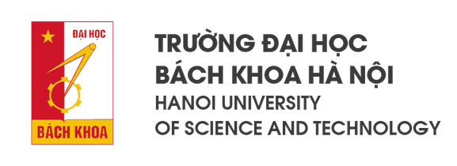
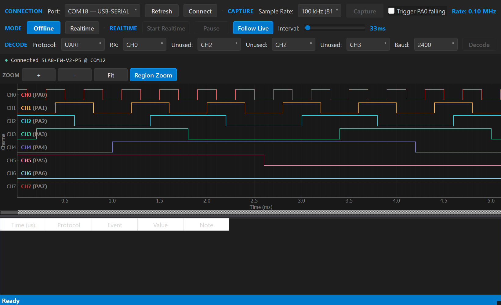
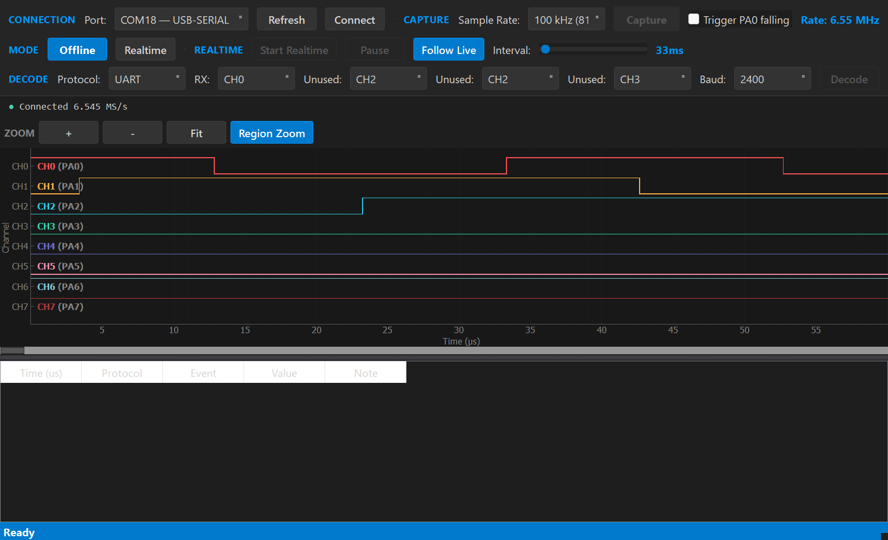
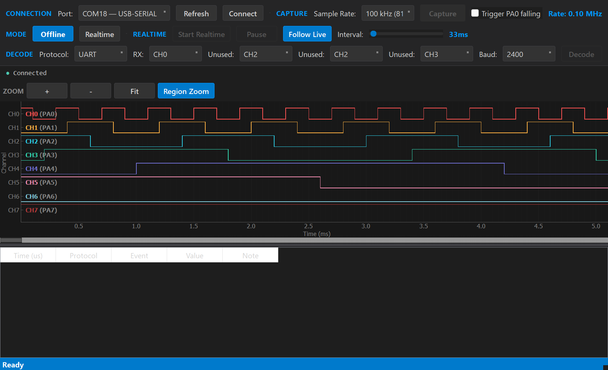
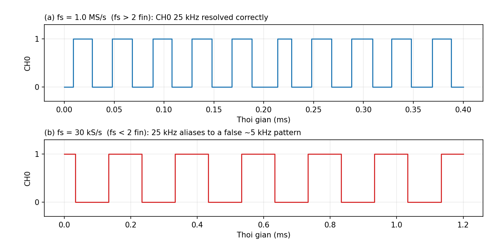
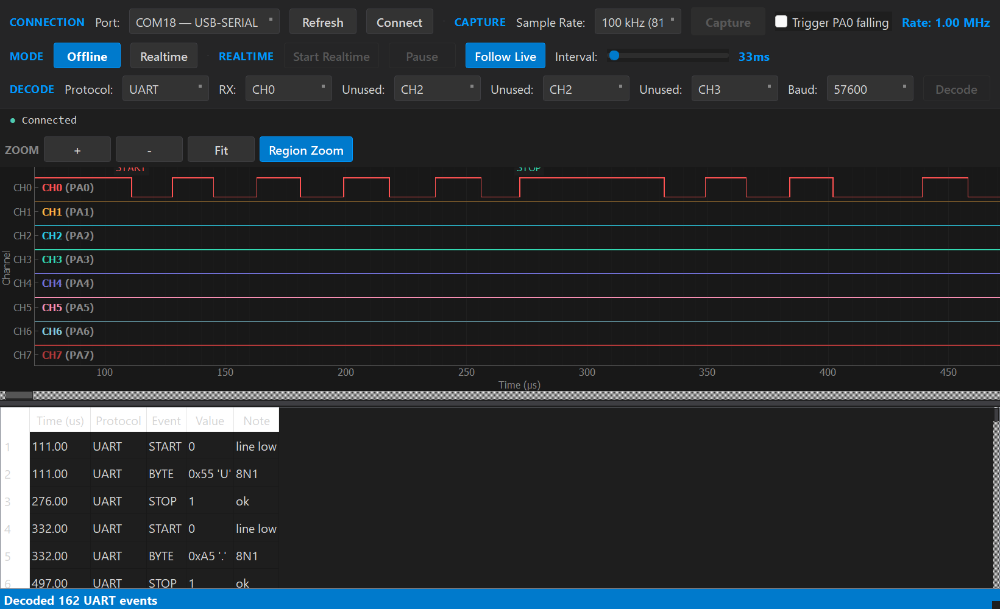
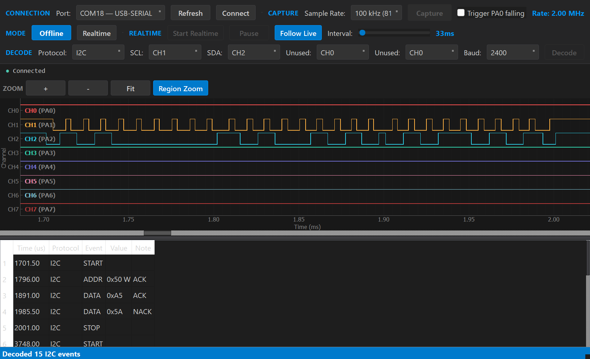
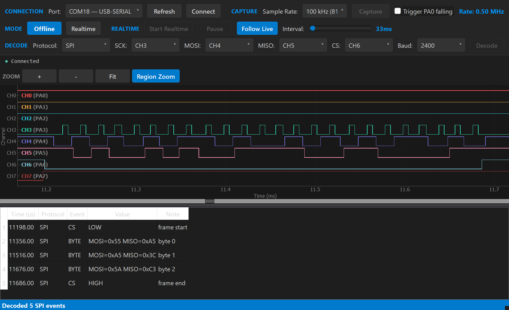
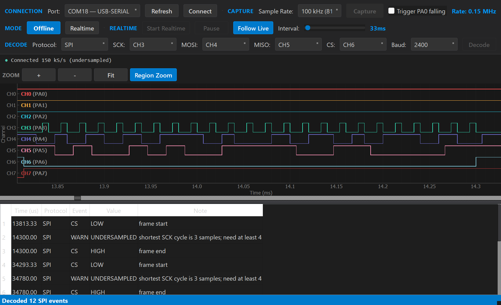
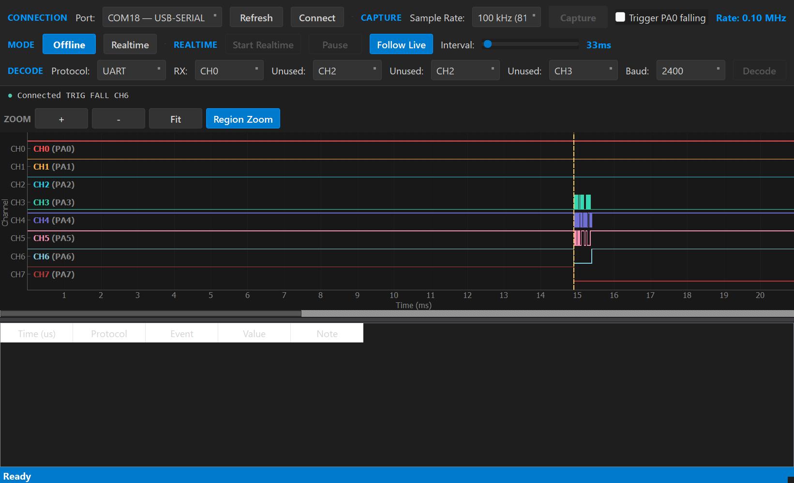

# BTL_slide_hoan_chinh

- Source: `BTL_slide_hoan_chinh.pptx`
- Total slides: 15

## Slide 1

BÁO CÁO BÀI TẬP LỚN

THIẾT KẾ VÀ XÂY DỰNGTHIẾT BỊ LOGIC ANALYZER ĐƠN GIẢN

Đề tài 1 · Hệ thống nhúng và thiết kế giao tiếp nhúng

Đoàn Sinh Đức — 20234000Phạm Đăng Vinh — 20233719Vũ Mạnh Quân — 20234033Vũ Nam Khánh — 20234015

GIẢNG VIÊN HƯỚNG DẪNTS. ĐÀO VIỆT HÙNG

Hà Nội, 7/2026

### Speaker Notes

Nhóm trình bày kết quả thiết kế và xây dựng thiết bị phân tích logic tám kênh trên STM32F103C8. Nội dung tập trung vào kiến trúc, cơ chế lấy mẫu, phần mềm hiển thị và các kết quả kiểm thử phần cứng trong vòng.

## Slide 2

- TRƯỜNG ĐẠI HỌC BÁCH KHOA HÀ NỘI
- HANOI UNIVERSITY OF SCIENCE AND TECHNOLOGY

ĐẶT VẤN ĐỀ

02

LỖI SỐ KHÔNG CHỈ NẰM Ở MỨC 0/1

GHI NHẬN

PHÂN TÍCH

8 đường tín hiệutại cùng thời điểm

Waveform+ decoder

•

Quan hệ thời gian giữa các kênh quyết định tính đúng của giao tiếp.

•

Thiếu xung, sai thứ tự cạnh hoặc sai khung rất khó quan sát bằng đồng hồ đo.

•

Cần ghi đồng thời nhiều tín hiệu và xem lại theo trục thời gian trên máy tính.

Logic analyzer biến chuỗi trạng thái rời rạc thành bằng chứng về timing và giao thức.

THIẾT BỊ LOGIC ANALYZER 8 KÊNH

### Speaker Notes

Trong hệ thống số, mức điện áp đúng chưa đủ để kết luận giao tiếp đúng. Nhiều lỗi chỉ xuất hiện trong quan hệ thời gian giữa các đường tín hiệu, vì vậy nhóm cần một công cụ ghi đồng thời nhiều kênh và cho phép phân tích lại trên máy tính.

## Slide 3

- TRƯỜNG ĐẠI HỌC BÁCH KHOA HÀ NỘI
- HANOI UNIVERSITY OF SCIENCE AND TECHNOLOGY

MỤC TIÊU VÀ PHẠM VI

03

8 KÊNH

TỪ 1 kHz

THU NGOẠI TUYẾN

PC GUI

3 DECODER

CH0–CH7PA0–PA7

Cấu hình tốc độlấy mẫu

Buffer → DUMPkhung SLA8

Waveform, đo cạnh,zoom và cuộn

UART · I2C · SPI

PHẠM VI TRIỂN KHAI

•

Firmware STM32: TIM2, DMA/ISR, trigger và giao thức lệnh.

•

Phần mềm PC: kiểm khung, hiển thị tám kênh và giải mã giao thức.

•

Arduino UNO tạo tín hiệu Gray, UART, I2C và SPI để kiểm thử từng chế độ.

THIẾT BỊ LOGIC ANALYZER 8 KÊNH

### Speaker Notes

Mục tiêu tối thiểu của đề tài là hai kênh và tốc độ từ một kilohertz. Mẫu thử thực tế được triển khai với tám kênh, có giao diện máy tính và ba bộ giải mã giao thức. Phạm vi đánh giá gồm cả firmware, khung truyền dữ liệu và phần mềm PC.

## Slide 4

- TRƯỜNG ĐẠI HỌC BÁCH KHOA HÀ NỘI
- HANOI UNIVERSITY OF SCIENCE AND TECHNOLOGY

KIẾN TRÚC TỔNG THỂ

04

STM32F103C8

NGUỒN TÍN HIỆU

MÁY TÍNH

PA0–PA7 → GPIOA IDRTIM2 tạo nhịp lấy mẫuDMA hoặc ISR → buffer 13.888 mẫuSLA8: metadata + payload + checksum

Arduino UNOGray · UART · I2C · SPIOpen-drain, chung GND

USART1 · 1 MbaudPyQt5 + pyqtgraphWaveform 8 kênhUART · I2C · SPI decoder

Một mẫu = một lần đọc đồng thời 8 bit thấp của GPIOA

THIẾT BỊ LOGIC ANALYZER 8 KÊNH

### Speaker Notes

Kiến trúc được chia thành ba lớp. Arduino tạo tín hiệu tham chiếu, STM32 lấy mẫu tám bit đồng thời và đóng gói thành khung SLA8, còn phần mềm PC kiểm tra khung rồi hiển thị hoặc giải mã. Việc đọc GPIOA IDR một lần giúp giảm sai lệch tương đối giữa các kênh.

## Slide 5

- TRƯỜNG ĐẠI HỌC BÁCH KHOA HÀ NỘI
- HANOI UNIVERSITY OF SCIENCE AND TECHNOLOGY

PHẦN CỨNG VÀ ĐẤU NỐI

05

STM32F103C8

ARDUINO UNO

NGUYÊN TẮC AN TOÀN

• PA0–PA7: CH0–CH7• PA9/PA10: USART1• Timer clock: 72 MHz• Logic: 3,3 V• Buffer: 13.888 byte

• D2–D9 → PA0–PA7• Tạo mẫu Gray 8 bit• Phát UART/I2C/SPI riêng• Ngõ ra open-drain• Dùng pull-up 3,3 V

• Nối chung GND• Không đưa 5 V trực tiếp• HIGH nhờ pull-up 3,3 V• Kiểm tra mức trước khi test• Không suy diễn mạch bảo vệ

Không khẳng định có khối bảo vệ đầu vào khi chưa có sơ đồ nguyên lý được kiểm chứng.

THIẾT BỊ LOGIC ANALYZER 8 KÊNH

### Speaker Notes

Tám đầu vào được đưa trực tiếp vào PA0 đến PA7, còn USART1 dùng để truyền dữ liệu về máy tính. Arduino được cấu hình open-drain để mức cao do điện trở kéo lên ba phẩy ba volt tạo ra. Báo cáo không giả định thêm khối bảo vệ đầu vào vì chưa có sơ đồ nguyên lý đầy đủ.

## Slide 6

- TRƯỜNG ĐẠI HỌC BÁCH KHOA HÀ NỘI
- HANOI UNIVERSITY OF SCIENCE AND TECHNOLOGY

CƠ CHẾ LẤY MẪU DMA VÀ ISR

06

TRIGGER TỨC THỜI

6,545 MS/s

TIM2 UPDATE

DMA1 CH2

BUFFER ĐỦ

Nhịp lấy mẫu

GPIOA IDR → RAM

Phát EVENT

Trần DMA được kiểm chứng

TRIGGER CẠNH / MẪU

400 kS/s

Trần ISR được kiểm chứng

TIM2 ISR

PRE-TRIGGER

POST-TRIGGER

Đọc và kiểm điều kiện

Bộ đệm vòng

Hoàn thành capture

THIẾT BỊ LOGIC ANALYZER 8 KÊNH

### Speaker Notes

Với trigger tức thời, DMA chuyển trực tiếp trạng thái GPIO vào RAM nên đạt tốc độ cao hơn. Khi cần trigger cạnh hoặc mẫu, ISR phải kiểm tra điều kiện và quản lý vùng trước sau trigger, vì vậy trần tốc độ thấp hơn. Hai giới hạn trên đều được xác nhận bằng kiểm thử phần cứng.

## Slide 7

- TRƯỜNG ĐẠI HỌC BÁCH KHOA HÀ NỘI
- HANOI UNIVERSITY OF SCIENCE AND TECHNOLOGY

FIRMWARE VÀ KHUNG DỮ LIỆU SLA8

07

CFG

ARM

CAPTURE

EVENT

DUMP

KHUNG SLA8

HEADER 48 B

METADATA

PAYLOAD ≤ 13.888 B

CHECKSUM

•

1 byte cho mỗi mẫu tám kênh.

•

Checksum FNV-1a cho header và payload.

•

Metadata lưu rate, mode, trigger và trạng thái lỗi.

THIẾT BỊ LOGIC ANALYZER 8 KÊNH

### Speaker Notes

Firmware làm việc theo chuỗi cấu hình, arm, capture, báo sự kiện rồi mới dump dữ liệu. Khung SLA8 tách metadata khỏi payload và dùng checksum FNV một a để phát hiện lỗi truyền. Mỗi mẫu chỉ chiếm một byte vì tám kênh được đóng vào tám bit.

## Slide 8

- TRƯỜNG ĐẠI HỌC BÁCH KHOA HÀ NỘI
- HANOI UNIVERSITY OF SCIENCE AND TECHNOLOGY

PHẦN MỀM PC VÀ GIAO DIỆN

08

KẾT NỐI

INFO · STATUS · cấu hình

WAVEFORM

8 kênh · zoom · cuộn

PHÂN TÍCH

Đo cạnh · tần số · decoder

Trạng thái trong ảnh xác nhận SLA8-FW trên COM12; dropdown Port chỉ là lựa chọn giao diện

THIẾT BỊ LOGIC ANALYZER 8 KÊNH

### Speaker Notes

Phần mềm PC chịu trách nhiệm cấu hình thiết bị, nhận khung và kiểm checksum trước khi hiển thị. Người dùng có thể xem tám kênh, phóng to theo thời gian, đo cạnh và chạy các decoder UART, I2C hoặc SPI trên dữ liệu đã thu.

## Slide 9

- TRƯỜNG ĐẠI HỌC BÁCH KHOA HÀ NỘI
- HANOI UNIVERSITY OF SCIENCE AND TECHNOLOGY

PHƯƠNG PHÁP KIỂM THỬ PHẦN CỨNG TRONG VÒNG

09

ARDUINO · COM18

STM32 · COM12

SLA8 + CHECKSUM

ORACLE

Tín hiệu tham chiếu

Thu tám kênh

Khung bằng chứng

Đối chiếu tự động

TOÀN VẸN

TỐC ĐỘ

GIAO THỨC

TRIGGER

TC01–TC02Khung, 8 kênh, Gray

TC03–TC06Rate, trần, Nyquist

TC07–TC09UART, I2C, SPI

TC10Cạnh rơi và đầu vào sai

Gray 8 bit: mỗi bước hợp lệ chỉ thay đổi đúng một bit

THIẾT BỊ LOGIC ANALYZER 8 KÊNH

### Speaker Notes

Kiểm thử phần cứng trong vòng dùng Arduino làm nguồn tham chiếu và STM32 làm thiết bị cần đánh giá. Chuỗi Gray phù hợp để phát hiện mất mẫu hoặc sai quan hệ giữa kênh vì hai trạng thái liên tiếp chỉ được phép khác một bit. Mười kịch bản được nhóm theo toàn vẹn, tốc độ, giao thức và trigger.

## Slide 10

- TRƯỜNG ĐẠI HỌC BÁCH KHOA HÀ NỘI
- HANOI UNIVERSITY OF SCIENCE AND TECHNOLOGY

KẾT QUẢ TỐC ĐỘ VÀ TOÀN VẸN DỮ LIỆU

10

6,545 MS/s

DMA sạch · sai số 0,0079%

400 kS/s

ISR sạch · 0 overrun

0

Overflow · dropped · checksum lỗi

7 / 8 / 10 MS/s bị firmware từ chối thay vì thu sai

TC-04 phát lại offline từ frame .sla8; dropdown Port không phải nguồn capture

THIẾT BỊ LOGIC ANALYZER 8 KÊNH

### Speaker Notes

DMA thu sạch tại sáu phẩy năm bốn năm megasample mỗi giây với sai số dưới một phần trăm nghìn. ISR đạt bốn trăm kilosample mỗi giây và không ghi nhận overrun. Khi yêu cầu vượt trần, firmware trả lỗi thay vì tiếp tục với dữ liệu không đáng tin cậy.

## Slide 11

- TRƯỜNG ĐẠI HỌC BÁCH KHOA HÀ NỘI
- HANOI UNIVERSITY OF SCIENCE AND TECHNOLOGY

TÁM KÊNH ĐỒNG THỜI VÀ GIỚI HẠN NYQUIST

11

Gray 8 kênh: 0 lỗi chuỗi, 0 short run

25 kHz: đúng ở 1 MS/s, alias khoảng 5 kHz ở 30 kS/s

Skew < 1 chu kỳ mẫu là chặn trên từ oracle Gray — không phải phép đo jitter tuyệt đối.

THIẾT BỊ LOGIC ANALYZER 8 KÊNH

### Speaker Notes

Dữ liệu Gray xác nhận đủ tám kênh và không phát hiện lỗi trình tự trong cửa sổ kiểm thử. Từ oracle này chỉ có thể kết luận sai lệch giữa kênh nhỏ hơn một chu kỳ mẫu, chưa thể coi là phép đo jitter tuyệt đối. Thử nghiệm Nyquist cho thấy lấy mẫu quá thấp biến tín hiệu hai mươi lăm kilohertz thành thành phần giả khoảng năm kilohertz.

## Slide 12

- TRƯỜNG ĐẠI HỌC BÁCH KHOA HÀ NỘI
- HANOI UNIVERSITY OF SCIENCE AND TECHNOLOGY

GIẢI MÃ UART, I2C VÀ SPI

12

UART · 57.600 baud

I2C · 2 MS/s

SPI · 500 kS/s

55 A5 4F 4B · 0 framing error

START · 0x50 W · A5 ACK · 5A NACK · STOP

MOSI/MISO: 55/A5 · A5/3C · 5A/C3

Ảnh phát lại offline từ .sla8; COM12/COM18 được xác minh riêng bằng device probe.

THIẾT BỊ LOGIC ANALYZER 8 KÊNH

### Speaker Notes

Ba bộ giải mã được kiểm tra bằng tín hiệu thật. UART thu đúng chuỗi byte và không có lỗi framing, I2C nhận đúng địa chỉ cùng trạng thái ACK và NACK, còn SPI nhận đúng ba cặp MOSI và MISO trong giao dịch có chip select.

## Slide 13

- TRƯỜNG ĐẠI HỌC BÁCH KHOA HÀ NỘI
- HANOI UNIVERSITY OF SCIENCE AND TECHNOLOGY

TRIGGER VÀ XỬ LÝ TRƯỜNG HỢP BIÊN

13

SPI LẤY MẪU KHÔNG ĐỦ

TRIGGER FALL CH6

Cảnh báo UNDERSAMPLED · không phát byte sai

Trigger index 1490 · vùng pre-trigger giữ mức HIGH

Ảnh phát lại offline từ .sla8; đầu vào trigger/pattern sai được từ chối.

THIẾT BỊ LOGIC ANALYZER 8 KÊNH

### Speaker Notes

Thiết bị cần hành xử an toàn cả khi điều kiện đo không phù hợp. Với SPI bị lấy mẫu thiếu, decoder đưa ra cảnh báo và không tạo byte sai. Trigger cạnh rơi trên kênh sáu giữ được vùng trước trigger, còn cấu hình sai bị firmware từ chối rõ ràng.

## Slide 14

- TRƯỜNG ĐẠI HỌC BÁCH KHOA HÀ NỘI
- HANOI UNIVERSITY OF SCIENCE AND TECHNOLOGY

ĐỐI CHIẾU YÊU CẦU VÀ KẾT QUẢ

14

✓ 8 KÊNH

✓ 1 kHz → 6,545 MS/s

✓ GUI 8 KÊNH

Yêu cầu ≥ 2

Yêu cầu từ 1 kHz

Waveform + đo cạnh

✓ UART · I2C · SPI

✓ 10/10 TC

✓ FAIL-SAFE

Đã kiểm chứng vật lý

Toàn bộ kịch bản đạt

Từ chối rate/cấu hình sai

Kết quả được chốt từ metrics.json và capture .sla8 ngày 18/07/2026.

THIẾT BỊ LOGIC ANALYZER 8 KÊNH

### Speaker Notes

Mẫu thử vượt yêu cầu tối thiểu về số kênh và giữ được mức một kilohertz ở đầu dải. Giao diện hiển thị đủ tám kênh, ba decoder đều có bằng chứng vật lý và toàn bộ mười kịch bản kiểm thử đạt. Các trường hợp vượt giới hạn được từ chối thay vì âm thầm sinh dữ liệu sai.

## Slide 15

- TRƯỜNG ĐẠI HỌC BÁCH KHOA HÀ NỘI
- HANOI UNIVERSITY OF SCIENCE AND TECHNOLOGY

HẠN CHẾ, HƯỚNG PHÁT TRIỂN VÀ KẾT LUẬN

15

HẠN CHẾ HIỆN TẠI

HƯỚNG PHÁT TRIỂN

• Chưa đo jitter tuyệt đối bằng chuẩn thời gian độc lập.• Chưa có sơ đồ nguyên lý đầu vào đầy đủ.• SPI mới hỗ trợ cạnh lên, MSB-first.• Trigger dùng ISR giới hạn ở 400 kS/s.

• Đo jitter/skew bằng tín hiệu tham chiếu chung.• Bổ sung CPOL, CPHA và thứ tự bit cho SPI.• Hoàn thiện sơ đồ đấu nối và quy trình kiểm mức.• Tối ưu trigger tốc độ cao.

Mẫu thử logic analyzer 8 kênh đã chạy HIL, giải mã ba giao thức và hành xử an toàn khi vượt giới hạn.

XIN CẢM ƠN!

KẾT LUẬN

### Speaker Notes

Hệ thống vẫn còn các giới hạn cần được trình bày trung thực, đặc biệt là jitter tuyệt đối, mạch đầu vào và cấu hình SPI. Tuy vậy, mẫu thử đã hoàn thành chuỗi chức năng chính từ thu tám kênh, truyền khung, hiển thị đến giải mã và trigger. Kết quả HIL cho thấy hệ thống hoạt động ổn định trong miền đã kiểm chứng và từ chối các cấu hình vượt giới hạn.
